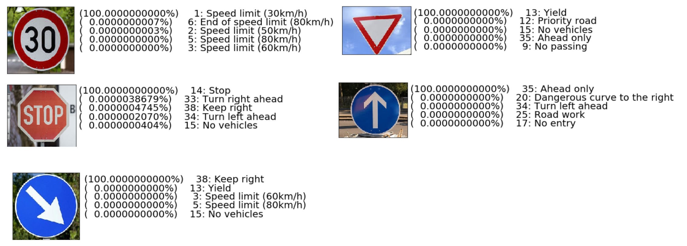

# **Traffic Sign Recognition** 

#**Adalberto Gonzalez**

The following Writeup includes all the rubric points and how you addressed each one of them for the folowing code [project code](https://github.com/adl-aleb/traffic_classifier/blob/master/Traffic_Sign_Classifier.ipynb)

---
**Build a Traffic Sign Recognition Project**

The goals / steps of this project are the following:
* Load the data set (see below for links to the project data set)
* Explore, summarize and visualize the data set
* Design, train and test a model architecture
* Use the model to make predictions on new images
* Analyze the softmax probabilities of the new images


## 1. Dataset Exploration

### Dataset Summary
code cell 3
* The size of training set is 34799
* The size of test set is 12630
* The shape of a traffic sign image is 32x32 in color (32,32,3) 
* The number of unique classes/labels in the data set is 43

#### Exploratory Visualization
code cell 4-7  

Here is an exploratory visualization of the data set. 


 <figcaption>
 <p></p> 
 <p style="text-align: center;"> "here we take a look at the unique images that are contained into our data set"</p> 
 </figcaption> 


 <figcaption>
 <p></p> 
 <p style="text-align: center;"> "On the barchart we can see the number of samples that we have available"</p> 
 </figcaption> 

## 2. Design and Test a Model Architecture

### Preprocessing
code cell 8-14

As a first step, I decided to convert the images to grayscale because the color is not relevant for the detection since all images are different and then i normalized the images because some of them seem to have different color intensity


 <figcaption>
 <p></p> 
 <p style="text-align: center;"> "Here is an example of a traffic sign image before and after grayscaling and normalization"</p> 
 </figcaption> 

### Model Architecture
code cell 15-17.  

* **Input : Convolutional.** accepts a 32x32xC image as input. where C is 1 since its grayscale.


* **Layer 1: Convolutional.** 1 stride, Output shape 28x28x6.
* **Activation relu.** computes rectified linear.
* **Pooling.** max, stride 2, Output shape should be 14x14x6.
* **Layer 2: Convolutional.** 1 stride, Output shape should be 10x10x16.
* **Activation relu.** Compute rectified linear.
* **Pooling.**  stride 2, Output shape 5x5x16.
* **Flatten.** Flatten the output shape of the final pooling layer such that it's 1D instead of 3D.
* **Layer 3: Fully Connected.**  120 outputs.
* **Activation relu.** compute rectified linear.
* **Layer 4: Fully Connected.**  84 outputs.
* **Activation relu.** compute rectified linear.
* **Dropout.** Compute dropout.
* **Layer 5: Fully Connected (Logits).** This should have 43 outputs.


* **Output .** 1 Return the result of the last fully connected layer.


### Model Training
to train the model i used used Adam optimizer with learning rate = 0.001. Batch size of 1284 was used and training was done for 30 epochs. The keep_prob for dropout layers was chosen to be 0.75 for conv layers .
for a 

### Solution Approach

This model is based on LeNet-5 architecture [LeNet-5](http://yann.lecun.com/exdb/lenet/) and the reason i used it its because has proven to be a good start point and then based on the initial result of 0.83 accuracy i decided to make adjustments,
* lenet inital model resulted in .83 acccuracy
* add dropout increasing acccuracy to .88, 
* increae EPOCHS for a 0.928 Valid Accuracy
* grayscale and normalize the image for an up to 0.941 Valid Accuracy

My final model results were:
* Valid Accuracy: 0.936 
* Test Accuracy = 0.918


 <figcaption>
 <p></p> 
 <p style="text-align: center;"> "Valid Accuracy vs Epochs"</p> 
 </figcaption> 

## 3. Test a Model on New Images

### Acquiring New Images
Here are five German traffic signs that I found on the web:
    

 <figcaption>
 <p></p> 
 <p style="text-align: center;"> "web images"</p> 
 </figcaption> 
i found the most challenging to predict would be the 1st one since we have several similitudes with another speed signs, however we have a good quantity of train images to overcome this situation, but thats not the case of the 3th one the stop sonce we have fewer images to "teach"

### Performance on New Images
our model predicted well and we recieved **a 100% Accuracy** overall and the Prediction seems to be consitent between what was expected and the outcome
* expected:  [ 1 13 14 35 38]
* prediction:[ 1 13 14 35 38]

however its only 5 images a lerger set of images would be adequate to confirm if this 100% is definitive 

### Model Certainty - Softmax Probabilities
our model has high certanty for this images the difference is 


 <figcaption>
 <p></p> 
 <p style="text-align: center;"> "Certainty - probabilities"</p> 
 </figcaption> 

thank you for reading.

Adalberto


```python

```
